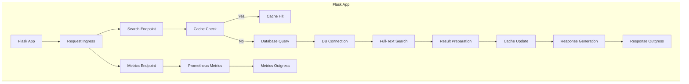

## Summary
I was asked this question for a Sr Engineering Manager role. In the interview, we focused on the search part of the API design. However, what you see here is how I would design it if I had more than 30 minutes to spare. It took me a total of 2 hours to come up with this high-level design and approximately 1 hour for somewhat detailed design of the Search Service. Basically, if I had 1 hour, this is how I'd whiteboard the search service. Whiteboarding this entire thing would take me 3 hours.

**This design covers the essential functionalities for a bookstore application, including user management, book management, search capabilities, and review handling, all integrated with PostgreSQL database features like JSONB for flexible data storage**

### Search Service
Using PostgreSQL with JSONB for data storage and PostgreSQL's full-text search capabilities is a powerful and an integrated solution for the bookstore search service. Here's a list of Technologies I chose:

* Backend Framework : Flask
* Database : PostgreSQL with JSONB for flexible data storage
* Full-Text Search : PostgreSQL's built-in full-text search capabilities
* Caching : Redis
* Load Balancer : ha-proxy
* Containerization : Docker
* Monitoring : Prometheus and Grafana
* Logging : ELK Stack (Elasticsearch, Logstash, Kibana)

**Search Service Diagram**


**Example Table**
```SQL
CREATE TABLE books (
    book_id SERIAL PRIMARY KEY,
    title VARCHAR(255) NOT NULL,
    author VARCHAR(255) NOT NULL,
    category VARCHAR(100),
    description TEXT,
    price DECIMAL(10, 2),
    published_date DATE,
    json_details JSONB
);

-- Indexes for full-text search that covers searches using multiple text fields
CREATE INDEX idx_fts_books ON books USING GIN (to_tsvector('english', title || ' ' || author || ' ' || description || ' ' || jsonb_extract_pathtext(json_details, 'summary')));
```
**Example Python Code: A Flask based service**
```python
from flask import Flask, request, jsonify
import psycopg2
import redis
import json
from prometheus_client import Counter
from prometheus_client.exposition import make_wsgi_app
from werkzeug.middleware.dispatcher import DispatcherMiddleware

# Initialize Flask app
app = Flask(__name__)

# Prometheus metrics
search_requests = Counter('search_requests_total', 'Total number of search requests')

# Redis Client
cache = redis.Redis(host='localhost', port=6379, db=0)

# Database Configuration
db_config = {
    'dbname': 'bookstore',
    'user': 'username',
    'password': 'password',
    'host': 'localhost'
}

def get_db_connection():
  """get database connection"""

    return psycopg2.connect(**db_config)

@app.route('/search', methods=['GET'])
def search_books():
    """search for books"""

    query = request.args.get('q', '')
    search_requests.inc()

    # Check cache
    cached_result = cache.get(query)
    if cached_result:
        return jsonify(json.loads(cached_result))

    # Connect to the database
    conn = get_db_connection()
    cur = conn.cursor()

    try:
        # Full-text search using PostgreSQL
        query_vector = f"(to_tsvector('english', COALESCE(description::text, ''))) @@ to_tsquery('english', %s)"
        cur.execute(f"""
            SELECT id, title, author, description
            FROM Book
            WHERE {query_vector}
            OR description ILIKE %s
        """, (query, f'%{query}%'))

        results = cur.fetchall()

        # Prepare results
        results_list = [{'id': row[0], 'title': row[1], 'author': row[2], 'description': row[3]} for row in results]

        # Cache the result
        cache.setex(query, 3600, json.dumps(results_list))

        return jsonify(results_list)

    finally:
        cur.close()
        conn.close()

# Prometheus metrics middleware
prom_app = make_wsgi_app()
app.wsgi_app = DispatcherMiddleware(app.wsgi_arn, {
    '/metrics': prom_app
})

if __name__ == '__main__':
    app.run(debug=False)
```

## Overall API design

#### Key APIs for the Backend of a Bookstore Application
* **User Management APIs**
  - Register User : /api/users/register (POST)
  - Login User : /api/users/login (POST)
  - Logout User : /api/users/logout (POST or DELETE)
  - Update User Profile : /api/users/profile (PUT or PATCH)
* **Book Management APIs**
  - Add Book : /api/books (POST)
  - Get Book Details : /api/books/{book_id} (GET)
  - Update Book : /api/books/{book_id} (PUT)
  - Delete Book : /api/books/{book_id} (DELETE)
* **Search APIs**
  - Search Books by Title : /api/books/search?title={title} (GET)
  - Search Books by Author : /api/books/search?author={author} (GET)
  - Search Books by Category : /api/books/search?category={category} (GET)
* **Review and Rating Management APIs**
  - Add Review/Rating : /api/books/{book_id}/reviews (POST)
  - Get Reviews for a Book : /api/books/{book_id}/reviews (GET)
  - Update Review : /api/books/{book_id}/reviews/{review_id} (PUT)
  - Delete Review : /api/books/{book_id}/reviews/{review_id} (DELETE)

#### Database Design
* **Tables**:
  - **users** : Stores user information and authentication details.
  - **books** : Stores book details with an additional json_details field for flexible storage.
  - **reviews** : Tracks user reviews and ratings for each book.
  - **user_roles** : Defines roles like 'admin' and 'user'.
  - **user_roles_mapping** : Maps users to their roles for authorization.

**Overall Design Diagram**

```mermaid
graph TD
  subgraph "`**User Management APIs**`"
    A1["Register User - POST
    /api/users/register"]
    A2["Login User - POST
    /api/users/login"]
    A3["Logout User - POST
    /api/users/logout"]
    A4["Update User Profile - PUT
    /api/users/profile"]
  end

  subgraph "`**Book Management APIs**`"
    B1["Add Book - POST
    /api/books"]
    B2["Get Book Details - GET
    /api/books/{book_id}"]
    B3["Update Book - PUT
    /api/books/{book_id}"]
    B4["Delete Book - DELETE
    /api/books/{book_id}"]
  end

  subgraph "`**Search APIs**`"
    C1["Search by Title - GET
    /api/books/search?title={title}"]
    C2["Search by Author - GET
    /api/books/search?author={author}"]
    C3["Search by Category - GET
    /api/books/search?category={category}"]
  end

  subgraph "`**Review and Rating Management APIs**`"
    D1["Add Review/Rating - POST
    /api/books/{book_id}/reviews"]
    D2["Get Reviews - GET
    /api/books/{book_id}/reviews"]
    D3["Update Review - PUT
    /api/books/{book_id}/reviews/{review_id}"]
    D4["Delete Review - DELETE
    /api/books/{book_id}/reviews/{review_id}"]
  end

  subgraph "`**Data Model (PostgreSQL)**`"
    Table1["users (Table)
    user_id (PK) - username - password_hash - email - created_at"]
    Table2["books (Table)
    book_id (PK)
    title
    author
    category
    description
    price
    published_date
    json_details"]
    Table3["reviews (Table)
    review_id (PK)
    book_id (FK)
    user_id (FK)
    rating
    comment
    created_at"]
    Table4["user_roles (Table)
    role_id (PK)
    role_name"]
    Table5["user_roles_mapping (Table)
    user_id (FK)
    role_id (FK)
    PRIMARY KEY(user_id, role_id)"]
  end

  %% Relationships between APIs and Data Model
  A1 --> Table1
  A2 --> Table1
  A4 --> Table1

  B1 --> Table2
  B2 --> Table2
  B3 --> Table2
  B4 --> Table2

  D1 --> Table3
  D2 --> Table3
  D3 --> Table3
  D4 --> Table3

  Table5 --> Table1
  Table5 --> Table4
```

