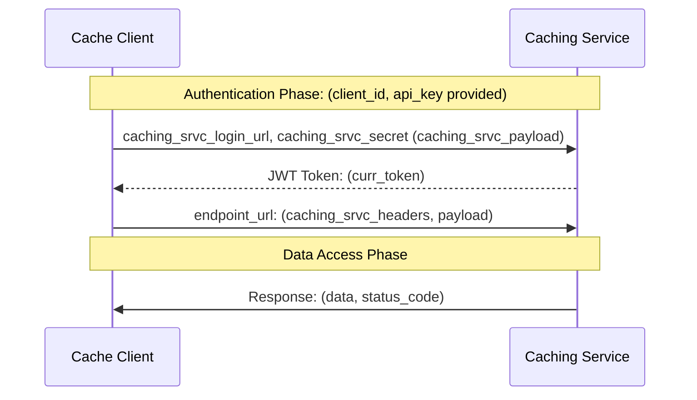
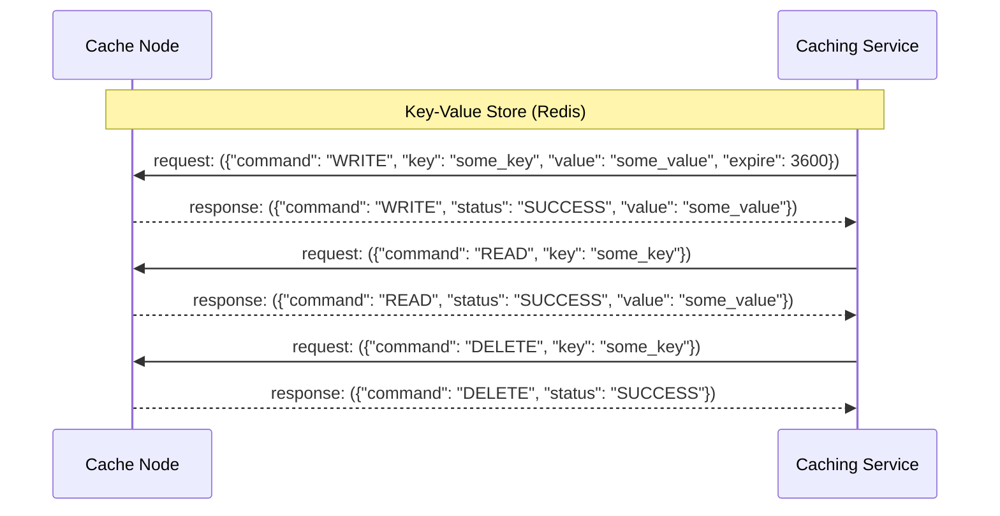
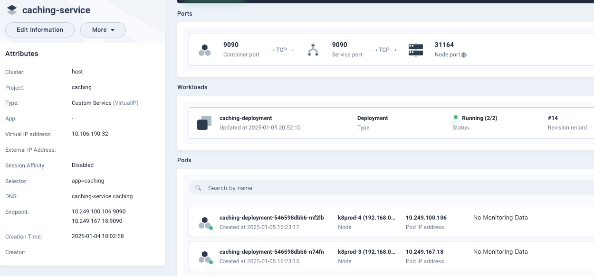

### Distributed Caching Service

A relatively efficient implementation of distributed caching using Redis with a Flask endpoint.

* Implements consistent hashing: ensures even distribution of keys across nodes.
* Implements a client interface/communication protocol: interact with this service via endpoint,
  defines a READ/WRITE/DELETE communication protocol.
* In addition to invalidation/deletion support, for scenarios where one does not want to invalidate cache, but
  keep data around for some time, the service utilizes key expire time functionality of Redis
  * It's a configurable option available through _**setup.config**_, the key expire time defaults to _**600**_ seconds. However,
  this can be overriden when calling the **WRITE** api.
* Replication: relies on Redis Server Replication (there are few other options available as well).
* Assumes: for this exercise, a Redis server with 1 master and 3 replicas.
* **Encrypt value**: see the _encryption.py_ module should you need to store encrypted values. See code example
  ```code
  value = encrypt_text(value).decode('utf-8')
  ```

#### Overview

**Client/Server Sequence Diagram**


**Server API Sequence Diagram**



##### Example Kubernetes Deployment


##### Generate SSL key/cert
* Gen SSL key/cert for secure connection to the service
    > openssl req -x509 -newkey rsa:4096 -nodes -out cert.pem -keyout key.pem -days 3650

#### Examples

**GET Bearer Token**
requires "jq" Command-line JSON processor 
```shell
> export api_key="your_api_key_here"
> export AT=$(curl -sk -X POST \
  https://localhost:9090/login \
  -H 'Content-Type: application/json' \
  -d '{
    "api_key": "'${api_key}'"
}' | jq -r .access_token)

```

**WRITE**
```shell
> curl -k -X POST \
  https://localhost:9090/cache \
  -H "Authorization: Bearer ${AT}" \
  -H 'Content-Type: application/json' \
  -d '{
    "command": "WRITE",
    "key": "my_key",
    "value": "my_value"
}'

{
  "command": "WRITE",
  "status": "SUCCESS",
  "value": "my_value"
}
* Closing connection
```

**READ**
```shell
curl -k -X POST \
  https://localhost:9090/cache \
  -H "Authorization: Bearer ${AT}" \
  -H 'Content-Type: application/json' \
  -d '{
    "command": "READ",
    "key": "my_key"
}'

{
  "command": "READ",
  "status": "SUCCESS",
  "value": "my_value"
}
```

**DELETE**
```shell
curl -k -X POST \
  https://localhost:9090/cache \
  -H "Authorization: Bearer ${AT}" \
  -H 'Content-Type: application/json' \
  -d '{
    "command": "DELETE",
    "key": "my_key"
}'

{
  "command": "DELETE",
  "message": "my_key Key deleted",
  "status": "SUCCESS"
}
```

### What are the benefits of a shared distributed caching service?

Here are some benefits:

**Microservices Architecture**: In a microservices architecture, different services often need to share common data or perform redundant computations. A distributed caching service can help in storing frequently accessed data or results of computations, reducing the load on backend databases and improving overall system performance.

**API Rate Limiting**: Services that provide APIs often need to implement rate limiting to prevent abuse and ensure fair usage. A distributed caching service can be used to store API usage information, such as request counts and rate limits, allowing for efficient rate limiting across multiple API instances.

**Session Management**: Web applications often use session management to maintain user state across requests. A distributed caching service can be used to store session data, allowing for seamless scalability and high availability across multiple application instances.

**Content Delivery Networks (CDNs)**: CDNs cache static content like images, videos, and scripts at edge locations closer to end-users to reduce latency and improve content delivery speed. A distributed caching service can complement CDNs by caching dynamic content and personalized data at the edge, further enhancing performance.

**Search Engines**: Search engines often cache search results, query responses, and frequently accessed documents to improve search performance and reduce query processing time. A distributed caching service can store these cached items, making search results readily available and improving overall search experience.

**E-commerce Platforms**: E-commerce platforms can benefit from caching frequently accessed product listings, pricing information, and user session data. A distributed caching service can help in reducing database load, improving page load times, and enhancing overall user experience.

**Real-time Analytics**: Systems that perform real-time analytics on streaming data can use a distributed caching service to cache intermediate results, precomputed aggregates, and frequently accessed data points. This can help in speeding up data processing and improving real-time decision-making.

**Online Gaming Platforms**: Online gaming platforms often require low-latency access to game state, player profiles, and matchmaking data. A distributed caching service can cache this data, reducing latency and providing a smoother gaming experience for players.
