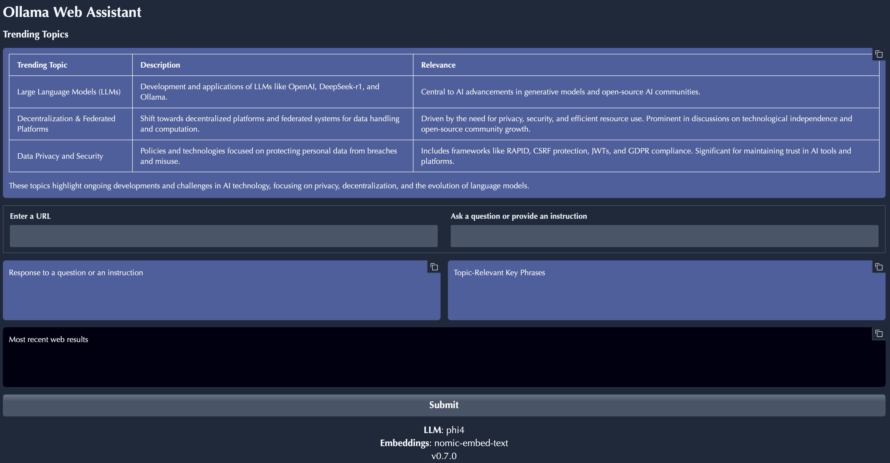

README
=====

Chat Ollama is a web-based application that uses natural language processing (NLP) and machine learning to answer questions based on a set of provided documents.



Table of Contents
-----------------

1. [Installation](#installation)
2. [Usage](#usage)
3. [Requirements](#requirements)
4. [Configuration](#configuration)

Installation
------------

To run the application, follow these steps:

1. Install Python 3.x on your system.
2. Install the required packages using pip: `pip install -r requirements.txt`
3. Clone this repository or download the code manually.

Usage
-----

### Basic Usage

1. Open the application in a web browser by visiting `<http://localhost:7860/>` (replace with the actual IP address if different).
2. Enter URLs separated by new lines into the "Enter URLs" field.
3. Type your question into the "Question" field.
4. Click the "Submit" button to generate answers based on the provided documents.

Configuration
-------------

The application uses a configuration file (`config.py`) to store database connection details and other settings. You can modify this file to suit your needs.

### Configuration File Structure

The `config.py` file should contain the following variables:

*   `psqldb`: A dictionary with the following keys:
    *   `host`
    *   `database`
    *   `user`
    *   `password`
    *   `port`

Example configuration file (`config.py`):
```python
import os

CONFIG = {
    'psqldb': {
        'host': 'localhost',
        'database': 'my_database',
        'user': 'my_user',
        'password': 'my_password',
        'port': 5432,
    }
}
```

Note: Make sure to replace the placeholders with your actual database connection details.

License
-------

Chat Ollama is licensed under the MIT License. See `LICENSE` for more information.

Acknowledgments
---------------

This project uses various libraries and frameworks, including:

*   Gradio for web application development
*   LangChain Community for NLP and machine learning tasks
*   PyPDFLoader and WebBaseLoader for document loading

Contributions
-------------

If you'd like to contribute to this project or have suggestions for improvement, please feel free to open a pull request on the repository.
