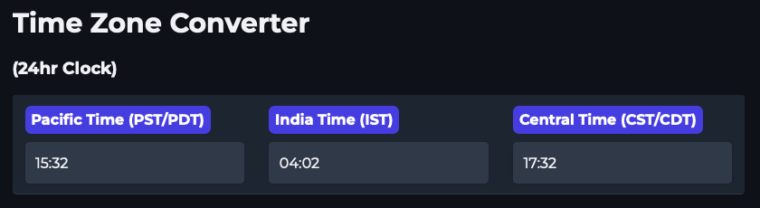

# Time Zone Converter Application

## Description
This Python application provides functions to convert times between various time zones, specifically Pacific Standard Time (PST), Indian Standard Time (IST), and Central Standard Time (CST).



## Installation
1. Ensure Python 3.x is installed on your system.
2. Install `pytz` library using pip:
   ```bash
   pip3 install -r requirements.txt
   ```

## Usage
### Functions

- **update_from_cst(cst_str)**: Converts a CST time string to PST and IST.

Example:
```python
result = update_from_cst("14:30")
print(result)  # Output might be ['07:00', '21:30', '14:30']
```

- **get_initial_times()**: Returns current times in PST, IST, and CST.

### Running the Application
Execute your script or module as needed based on your environment setup.

## Authors
- Your Name

## License
MIT License
