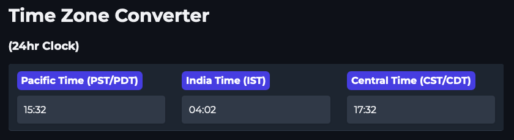

# Time Zone Converter Application

## Description
This Python application provides functions to convert times between various time zones, specifically Pacific Standard Time (PST), Indian Standard Time (IST), and Central Standard Time (CST).

You can edit the fields and enter a time in your desired time zone, hit tab or ENTER; the application will automatically convert it to other specified time zones.

#### Standalone HTML/JS/CSS single page app


#### Python App


## Installation
1. Ensure Python 3.x is installed on your system.
2. Install `pytz` library using pip:
   ```bash
   pip3 install -r requirements.txt
   ```

## Usage
### Running the Application
```bash
./time_zone_converter.py
```
## Authors
- Ollama/QWEN2.5-CODER:32B

## License
None - Do whatever you want with this (pd)
