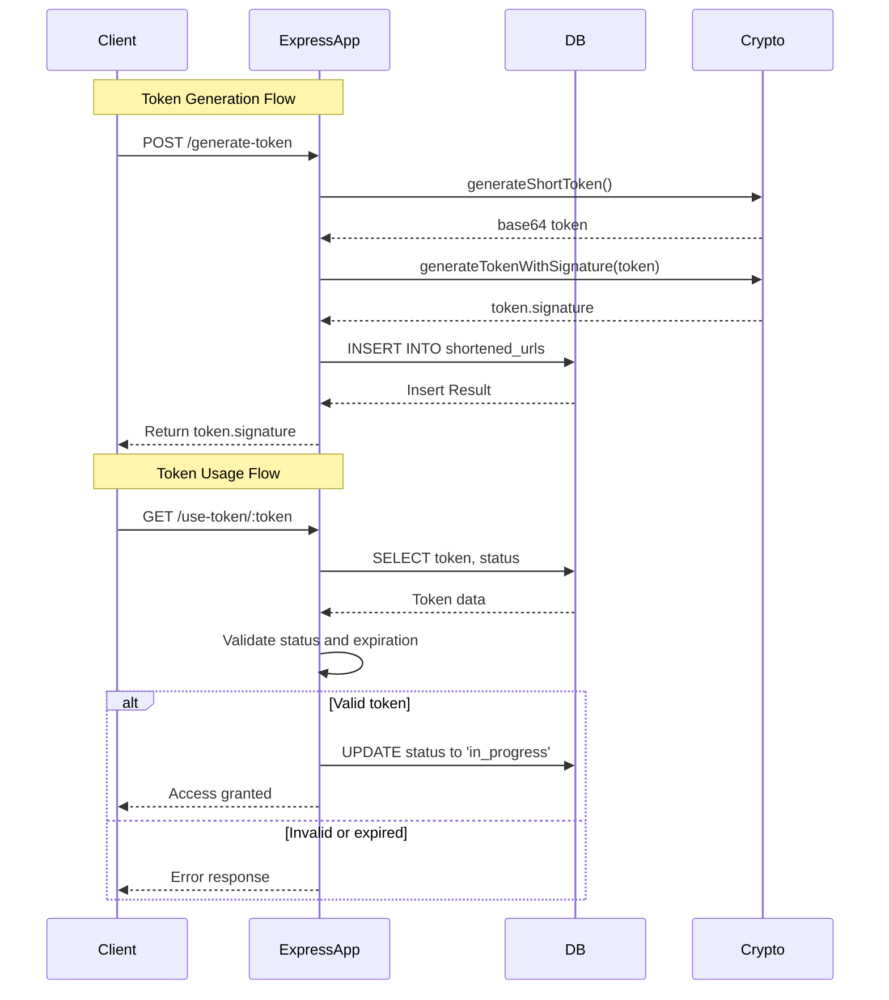
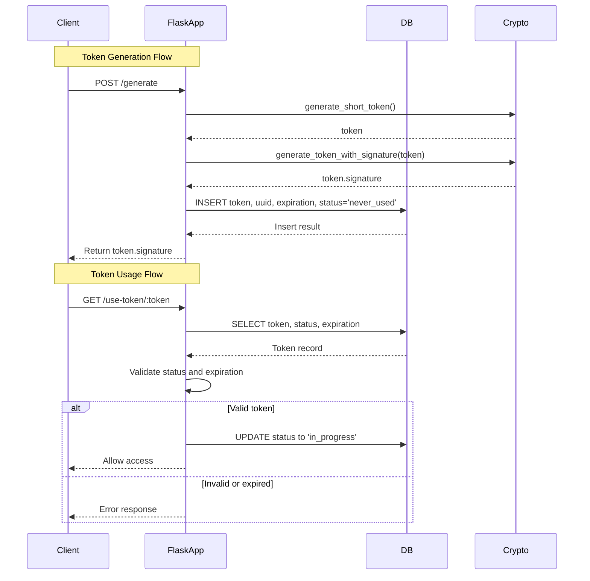

# Secure Token Shortening Service

A lightweight Flask-based service for generating and securely validating short-lived access tokens using HMAC signatures. Useful for one-time access links, session initiation, or short URLs.

## Features

- Generates short, 6-character tokens
- Adds a 3-character HMAC signature for tamper resistance
- Stores token metadata in an in-memory SQLite database
- Tracks status (`never_used`, `in_progress`, `expired`)
- Expiry control via timestamps
- REST API for integration

## Requirements

- Python 3.9+
- Flask

**NodeJS**
- Node 18+

Install dependencies:

**Python**
```bash
pip install Flask
```
**NodeJS**
```bash
npm install express sqlite3 crypto
```

### NodeJS Sequence Diagram


### Python (Flask) Sequence Diagram

