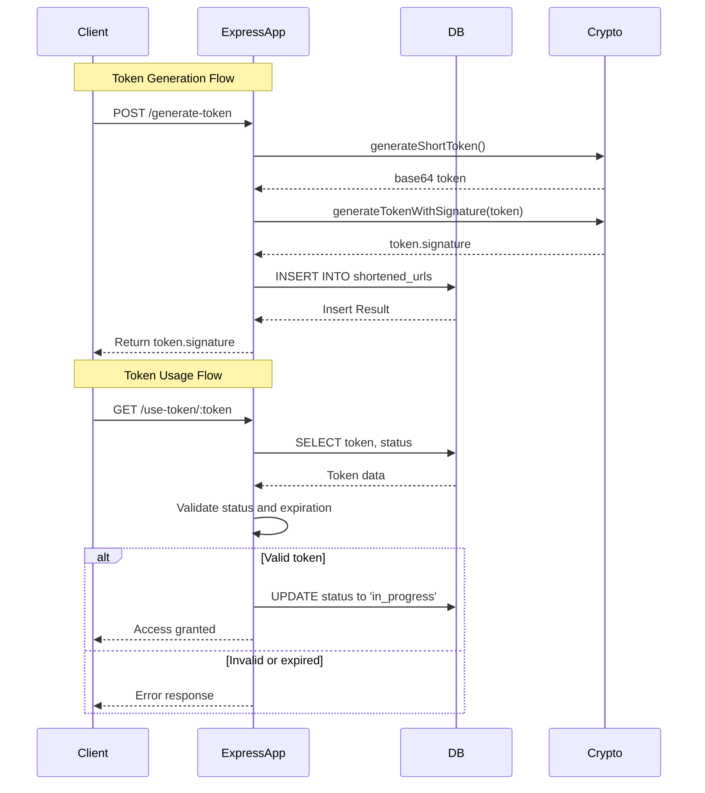
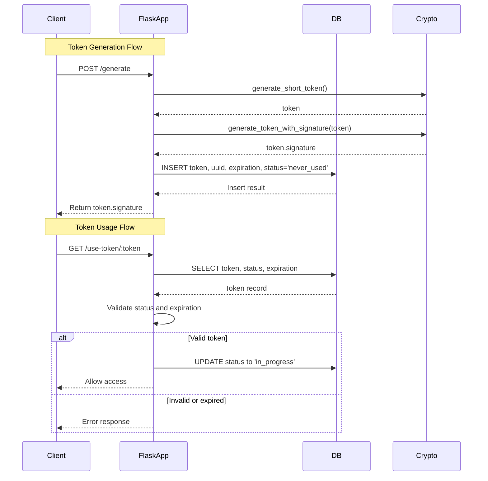

# Secure Token Shortening Service

A lightweight Flask-based service for generating and securely validating short-lived access tokens using HMAC signatures. Useful for one-time access links, session initiation, or short URLs.

## Features

- Generates short, 6-character tokens
- Adds a 3-character HMAC signature for tamper resistance
- Stores token metadata in an in-memory SQLite database
- Tracks status (`never_used`, `in_progress`, `expired`)
- Expiry control via timestamps
- REST API for integration

## Requirements

- Python 3.9+
- Flask

**NodeJS**
- Node 18+

Install dependencies:

**Python**
```bash
pip install Flask
```
**NodeJS**
```bash
npm install express sqlite3 crypto
```

## Examples
### Python

**Shorten a Url**
```bash
curl -X POST http://127.0.0.1:5000/shorten \
     -H "Content-Type: application/json" \
     -d '{"url": "https://foo.foo.us/1b4ed88ed56745a69c310b9d76d1f9fa"}'
```

**Response**
```bash
{
  "shortened_url": "https://foo.url/B6WxSf.GB0"
}
```

**Access the Shortened Url** 
```bash
curl 'http://127.0.0.1:5000/shortened/B6WxSf.GB0'
```
**States**
```bash
{
  "message": "URL is now in progress"
}
```

```bash
{
  "error": "URL is already in use"
}
```

```bash
{
  "error": "URL has expired"
}
```

### NodeJS

**Shorten a Url**
```bash
curl -X POST http://localhost:3000/shorten \
  -H "Content-Type: application/json" \
  -d '{"url": "https://example.com/uuid1234567890abcdef1234567890abcdef"}'
```
**Response**
```bash
{
  "shortened_url": "https://short.url/234567.AB1"
}
```
**Access the Shortened Url** 
```bash
curl 'http://127.0.0.1:3000/shortened/234567.AB1'
```
**States**
```bash
curl http://localhost:3000/shortened/234567.AB1
```

```bash
{"message":"URL is now in progress","original_url":"https://example.com/1234567890abcdef1234567890abcdef"}
```
```bash
{"error":"URL is already in use"}
```

```bash
{"error":"URL has expired"}
```

### NodeJS Sequence Diagram


### Python (Flask) Sequence Diagram

